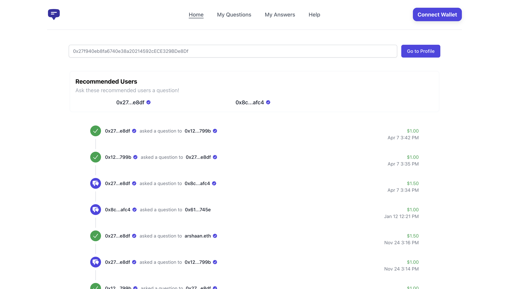

# Q&A Protocol

Makes it possible to message people and pay them to reply.

Visit [Q&A Protocol](https://www.qandaprotocol.com/) by clicking here.

## What is this repository?

This repository contains the front-end React code which allows you to connect to the website with your wallet. You can then ask questions to anyone you'd like on Polygon and incentivize them with a bounty using USDC.

## Usage

The product is currently in Beta and if you'd like access or have any questions or suggestions please contact me on Twitter (https://twitter.com/arshaan_b).

## Support

We're lucky to be working closely with the following organizations: Polygon, Antler.
